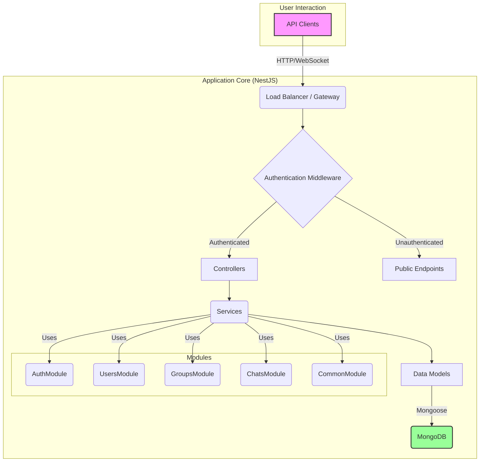

<p align="center">
  <a href="http://nestjs.com/" target="blank"></a>
</p>

<h1 align="center">Secure Group Chat Platform API</h1>

<p align="center">
  Backend app of a secure group messaging system that supports private and public groups, user auth, messaging and message encryption
</p>

---

## Table of Contents

- [Overview](#overview)
- [Features](#features)
- [Technology Stack](#technology-stack)
- [System Architecture](#system-architecture)
- [Getting Started](#getting-started)
  - [Prerequisites](#prerequisites)
  - [Installation](#installation)
  - [Environment Configuration](#environment-configuration)
  - [Running the Application](#running-the-application)
- [API Documentation](#api-documentation)
- [Deployment on Koyeb](#deployment-on-koyeb)
- [License](#license)

---

## Overview

This project is the backend for a secure group messaging system. It provides a comprehensive REST API for managing users, groups, and messages, along with a real-time communication layer using WebSockets. The system is designed with security and scalability in mind, featuring JWT-based authentication, message encryption, and role-based access control within groups.

## Features

- **User Authentication**: Secure user registration and login using JSON Web Tokens (JWT).
- **Group Management**:
  - Create, manage, and delete public (open) and private (closed) groups.
  - Robust role management (owner, members).
  - Functionality to join, leave, kick, and ban users.
  - A 48-hour cooldown period for rejoining private groups.
  - Ownership transfer capabilities.
- **Real-time Messaging**: WebSocket-based chat for instant communication within groups.
- **Message Encryption**: End-to-end encryption for all messages stored in the database.
- **API Documentation**: Interactive API documentation via Swagger UI.
- **Security**:
  - Request rate-limiting (throttling) to prevent abuse.
  - Security-focused HTTP headers using Helmet.
- **Payload compression**: For improved performance.
- **Structured Logging**: Comprehensive logging for requests, responses, errors, and debugging.
- **Future Enhancements**:
  - Switch to a more secure encryption algorithm for messages
  - Switch to Fastify for better performance
  - Add a cache layer to improve performance
  - Better error handling and logging (use OpenTelemetry and Sentry or similar)
  - Configure compression for different payload sizes
  - Add docker file for cross platform deployment
  - Implement tests using Jest and Supertest
  - Implement more features (e.g. password reset)

## Technology Stack

- **Framework**: [NestJS](https://nestjs.com/) (v11) with Express
- **Language**: [TypeScript](https://www.typescriptlang.org/)
- **Database**: [MongoDB](https://www.mongodb.com/) with [Mongoose](https://mongoosejs.com/)
- **Real-time Communication**: [Socket.IO](https://socket.io/)
- **Authentication**: [Passport.js](https://www.passportjs.org/) (JWT Strategy)
- **Security**: [Bcrypt](https://www.npmjs.com/package/bcrypt), [crypto-js](https://www.npmjs.com/package/crypto-js), [Helmet](https://helmetjs.github.io/), [@nestjs/throttler](https://www.npmjs.com/package/@nestjs/throttler)
- **API Documentation**: [Swagger (OpenAPI)](https://swagger.io/)
- **Validation**: [class-validator](https://github.com/typestack/class-validator)

---

## System Architecture

The application is built using a modular architecture, promoting separation of concerns and maintainability.



---

## Getting Started

### Prerequisites

- [Node.js](https://nodejs.org/en/) (v18 or higher)
- [npm](https://www.npmjs.com/)
- A running [MongoDB](https://www.mongodb.com/) instance (local or cloud-based like MongoDB Atlas).

### Installation

1.  Clone the repository:
    ```bash
    git clone <your-repository-url>
    cd chat-platform-backend
    ```
2.  Install the dependencies:
    ```bash
    npm install
    ```

### Environment Configuration

1.  In the root of the project, create a new file named `.env.development`.
2.  Copy the contents below into the file and adjust the values for your local environment.

    ```dotenv
    # Application Port
    DEV_PORT=4040

    # Database Configuration
    # For a local MongoDB instance
    DB_HOST=localhost
    DB_PORT=27017
    DB_NAME=chat-platform
    DB_USER=
    DB_PASSWORD=
    DB_AUTH=false

    # For a cloud MongoDB instance (e.g., Atlas)
    # DB_HOST=<your-atlas-cluster-url>
    # DB_USER=<your-db-user>
    # DB_PASSWORD=<your-db-password>
    # DB_NAME=<your-db-name>
    # DB_AUTH=true

    # Security Configuration
    # IMPORTANT: Use strong, randomly generated strings for production
    JWT_SECRET=a-very-secret-key-that-should-be-changed
    ENCRYPTION_KEY=a-secret-key-for-messages-12345
    ENCRYPTION_IV=a-secret-iv-for-messages-123456
    ```

### Running the Application

- **Development mode with watch:**
  ```bash
  npm run dev
  ```
- **Production build:**
  ```bash
  npm run build
  npm run prod
  ```

---

## API Documentation

Once the application is running, you can access the interactive API documentation (powered by Swagger) at:

**`http://localhost:4040/swagger`**

(Replace `4040` with the `DEV_PORT` you specified in your `.env.development` file if you changed it.)

---

## Usage of AI Tools

Certain AI tools were used to aid me during the development of this project.

- **Cursor**: I have used the Cursor IDE to plan out and write the code for the project.
- **Cursor Tab Model**: I have used Cursor tab model to provide me with quick suggestions and auto-complete parts of the code.
- **Cursor User Rules (Global)**: I have used the Cursor user rules for Nest.js provided by the [Cursor Directory](https://cursor.directory). This would allow for a more consistent coding style throughout the project and also help me with the code completion.
- **Cursor Project Rules (mdc file)**: I have created a .mdc file for project specific rules, so that any prompt used with this project would have more context about the general objective of the project and the codebase.
- **Gemini Pro 2.5**: I used Gemini Pro 2.5 to plan out the project and to generate the README.md file. This has created the implementation plan for the project under the /designs/design.md file. This file is split into implementation phases for each action and feature, so that I and any additional AI model can follow it through the implementation process.
- **Claude 4 Sonnet**: I used Claude 4 Sonnet to help me with executing the implementation plan and to answer simple questions about the project. This part of the process requires a model that is able to follow a plan and execute it step by step, without deviating from the plan or making assumptions, hence why I have used a non thinking model.

---

## Deployment on Koyeb

This application is configured for easy deployment on [Koyeb](https://www.koyeb.com/). Koyeb is a developer-friendly serverless platform that can deploy applications directly from a Git repository.

### How it Works

1.  **Push to GitHub**: Connect your GitHub account to Koyeb and select this repository.
2.  **Configure Service**: Koyeb will automatically detect the Node.js application. You will need to configure the following:
    - **Build Command**: `npm run build`
    - **Run Command**: `npm run start:prod`
    - **Port**: `8080` (or as configured by Koyeb).
3.  **Environment Variables**: Add all the variables from the `.env.development.example` file (using strong, production-safe secrets) to the Koyeb service's environment variable settings.
4.  **Deploy**: Koyeb will build and deploy the application. Future pushes to your default branch will automatically trigger new deployments.

You can also use the "Deploy to Koyeb" button for a quick start:

[](https://app.koyeb.com/deploy?type=git&repository=your-github-repo-url&branch=main&name=chat-api)

_(Note: Remember to replace `your-github-repo-url` in the button link with your actual repository URL.)_

---

## License

This project is [MIT licensed](https/github.com/nestjs/nest/blob/master/LICENSE).
